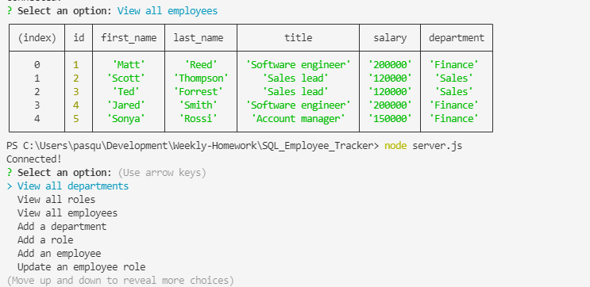

# SQL_Employee_Tracker

## Table of contents
* [General info](#general-info)
* [Technologies](#technologies)
* [Working Application](#working-application)
* [Project Status](#project-status)
* [Room for Improvement](#room-for-improvement)
* [Installation](#installation)
* [License](#license)
* [Contact Me](#contact-me)

## General info

The application allows to manage a company's database by viewing, adding, updating and deleting data. the user is presented with a list of choices that allows him to opt for: view all the departments, all the roles, all the employees, update each of them and delete items from them. 

## Technologies

Project is created with:
* Node.js
* Express.js
* MySQL

## Working Application

The following image shows the web application's appearance:

## Project Status

* Working

## Room for Improvement

Room for improvement:
* Code refactoring 

## Installation

To run locally the application clone [this link](https://github.com/Nico749/SQL_Employee_Tracker.git) on your local machine

## License

Distributed under MIT License.

## Contact me 

Created by [Nico Pasqualini](https://nico749.github.io/Personal-portfolio-/) - feel free to contact me!